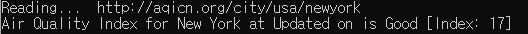
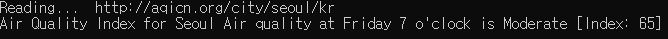
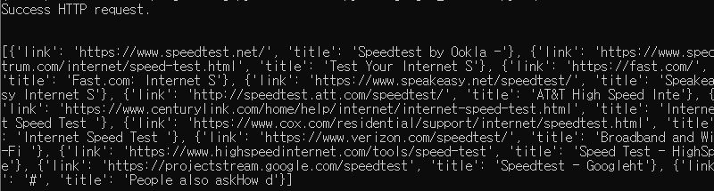

##### Web Crawler

- Air Quality Index
  - Command (with arguments)
    ```console 
    python AQI_crawler.py -c seoul -n kr
    python AQI_crawler.py -c usa -n newyork
    ** -c: city, -n: country
    ** the website path flow is a bit inconsistent across cities.
    ```
    
    
  - Reads information in Korean format, and undergoes processing steps (KOR-ENG translation, contextual correction) 

- Google Search
  - Searches for a user-specified query with proper header and maps links to found result title in JSON (dictionary) format. 
  - Command
    ```console
    python google_crawler.py --query test
    ```
    

***********

- Perceptron neural network with backpropgation (1-stage)
  ```script
  Random synaptic weights:
    [[-0.16595599]
    [ 0.44064899]
    [-0.99977125]]
  synaptic weights after training:
    [[ 9.67299303]
    [-0.2078435 ]
    [-4.62963669]]
    Input 1: 1
    Input 2: 2
    Input 3: 3
  ('New situation: input data = ', '1', '2', '3')
  Output data:
    [0.00964519]
  Random starting synaptic weights:
    [[-0.16595599]
    [ 0.44064899]
    [-0.99977125]]
  Synaptic weights after training
    [[10.38040701]
    [-0.20641179]
    [-4.98452047]]
  outputs after training:
    [[0.00679672]
    [0.99445583]
    [0.99548516]
    [0.00553614]]
  ```